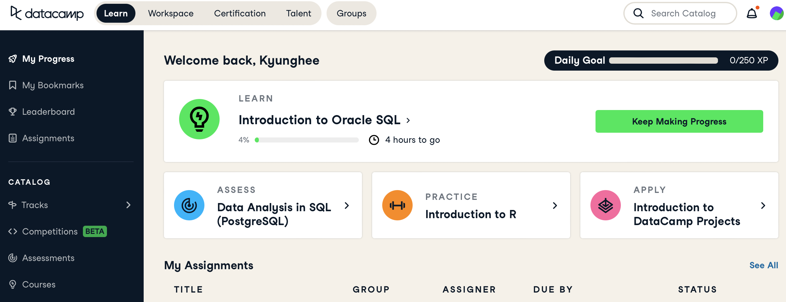

```{r setup, include=FALSE}
knitr::opts_chunk$set(echo = TRUE)
library(fontawesome)
```

# `r fa("dumbbell", fill = "steelblue")` Sign-up

- You must have received an invite to join DataCamp. You must sign up using your **@wayne.edu email.**  
- If you lost the invite, use the **the link below and your @wayne.edu email.**
- Click [https://www.datacamp.com/groups/shared_links/1ebdf45dbe8fdb11654d082c229389a16e3579f6d3c256ee6dd07010cb8cac39](https://www.datacamp.com/groups/shared_links/1ebdf45dbe8fdb11654d082c229389a16e3579f6d3c256ee6dd07010cb8cac39){target="_blank"} to create your DataCamp account.

# `r fa("tasks", fill = "steelblue")` Check your progress
When you log in, you will see `My Progress` on the left. This is where you can track the assignments and their due dates.  

```{r echo=FALSE, out.width="70%"}

```

# `r fa("star", fill = "steelblue")` Extra credit assignment

- Go to https://www.datacamp.com and log in. You must use the ID/PW created from the above link or invite.
- `My_Progress` and click `Introduction to Oracle SQL`
- You must complete **the entire course** to get the extra credits