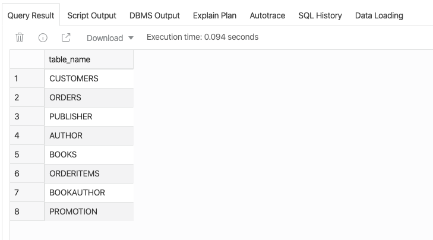

```{r setup, include=FALSE}
knitr::opts_chunk$set(echo = TRUE)
# knitr::read_chunk("../../global.R")
```
```{r global, echo=FALSE}
```

# Loading Dataset Onto Your Database
Your DB should be empty as it is, so we need to load some data to work on. Throughout the SQL lectures, we are going to use the JustLeeDB database for demonstration, and below is the step-by-step instruction on how to load the data on your server using SQL Developer Web.

1. Download this data file ([JustLeeDB.txt](https://khlee42.github.io/database/data/JustLeeDB.txt)) (If you’re using Safari, right click the link and click “Download linked file”)
2. Log in to your server using SQL Developer Web (through your unique URL)
3. Copy and paste the content of the data file onto a new worksheet. You can also drag and drop the data file. 
4. Click the "Run Script" button (or hit F5)

If you see the screenshot under the "Query Result" tab (scroll it down to the bottom), it means the data has been loaded successfully. 

You can ignore the error messages that appeared at the beginning.

```{r echo=FALSE, out.width="70%"}

```

# Populate Your Database

<iframe width="800" height="450" src="https://www.youtube.com/embed/1zGxwu40o-I" frameborder="0" allow="accelerometer; autoplay; encrypted-media; gyroscope; picture-in-picture" allowfullscreen data-external="1"></iframe>  
